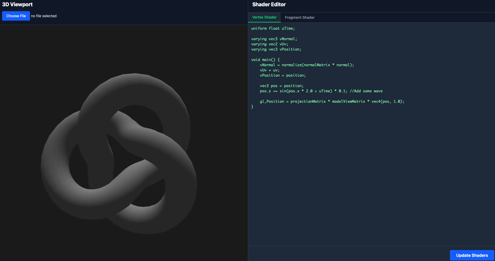

# 🎨 Blender Shader Application (React + TypeScript + Vite)

This repository hosts a web-based shader application designed to seamlessly integrate with Blender objects. It provides a real-time environment for viewing and editing GLSL shaders, allowing for dynamic updates on 3D models.

---

## ✨ Features

This application is divided into two main panels:

### Left Panel (3D Viewport)

- **Three.js-powered 3D Rendering**: Experience smooth and interactive 3D visualizations.
- **Blender Object Loading**: Easily import your 3D models with support for common formats (`.glb`).
- **Animated 3D Objects**: See your shaders come to life on animated models with real-time updates.

### Right Panel (Shader Editor)

- **Split View Editor**: Dedicated editors for both **vertex** and **fragment** shaders, allowing for focused development.
- **Real-time Editing**: Edit your shader code in a clean, monospace font environment.

---

## 🚀 How it Works

### Instant Shader Updates

The **Bottom Right Update Button** allows you to instantly apply your shader changes to the 3D object in the viewport.

---

## 🛠️ Technical Stack

- **React + TypeScript**: Provides a robust and type-safe component architecture for a scalable application.
- **Three.js**: Powers the high-performance 3D rendering and comprehensive shader management.
- **Tailwind CSS**: Ensures responsive, modern, and highly customizable styling throughout the application.

---

## 📺 Scene Demo

